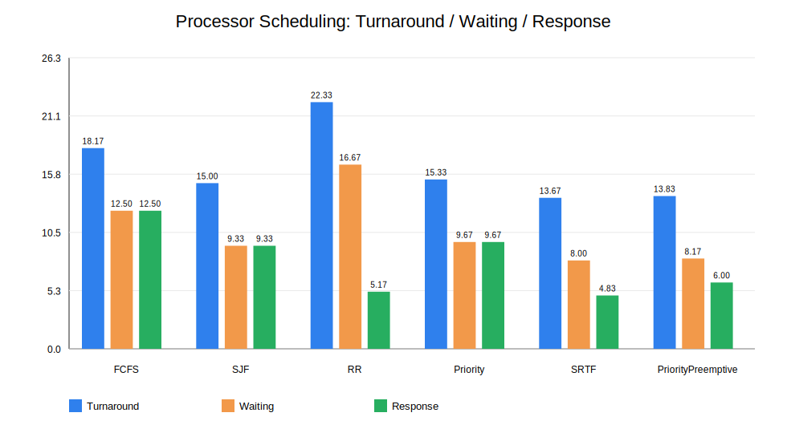
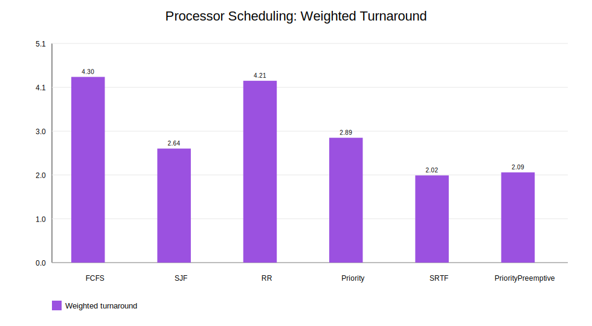
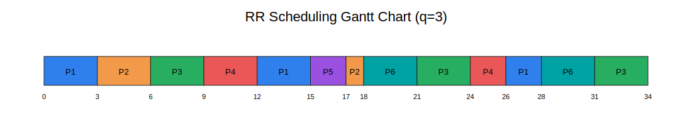
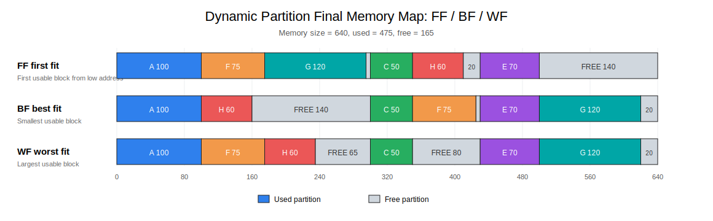
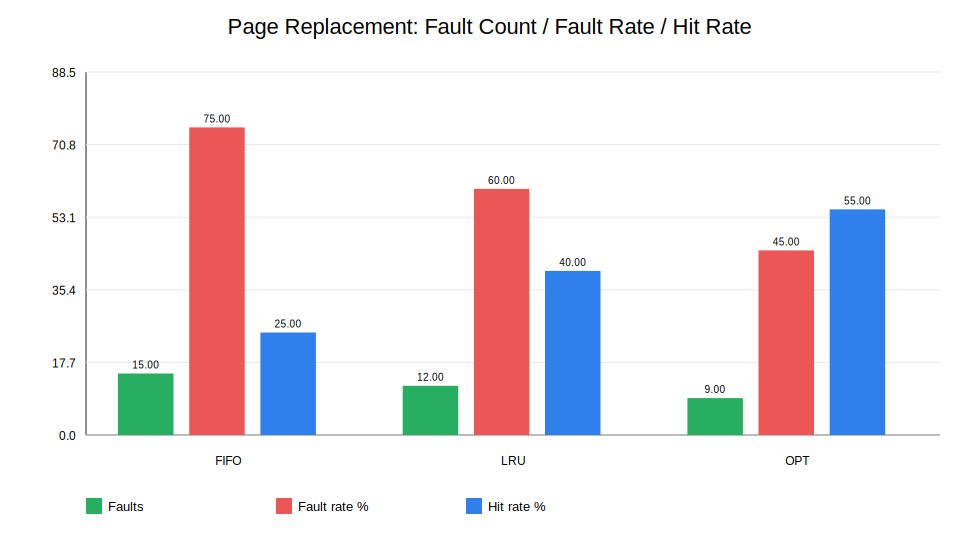
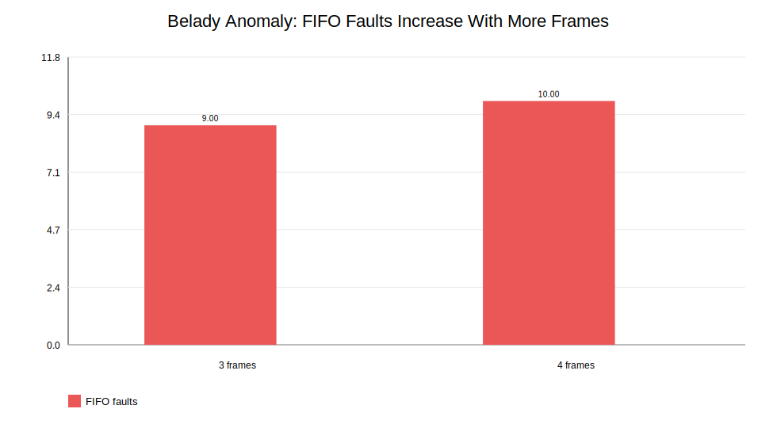
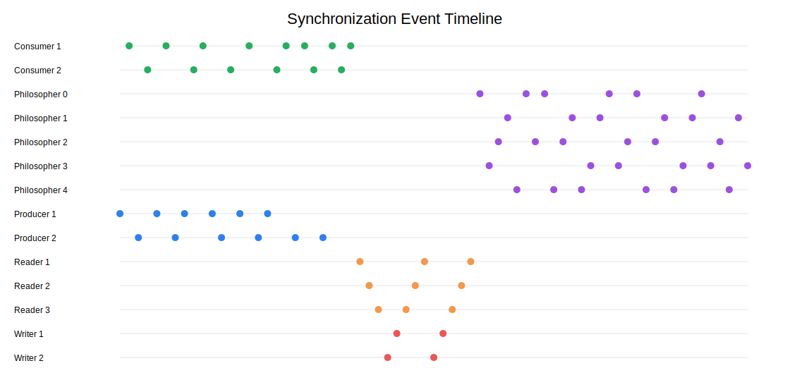
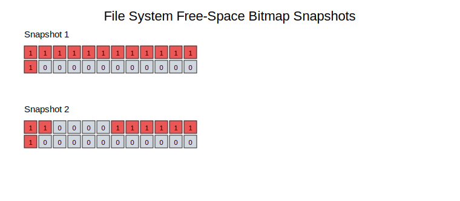
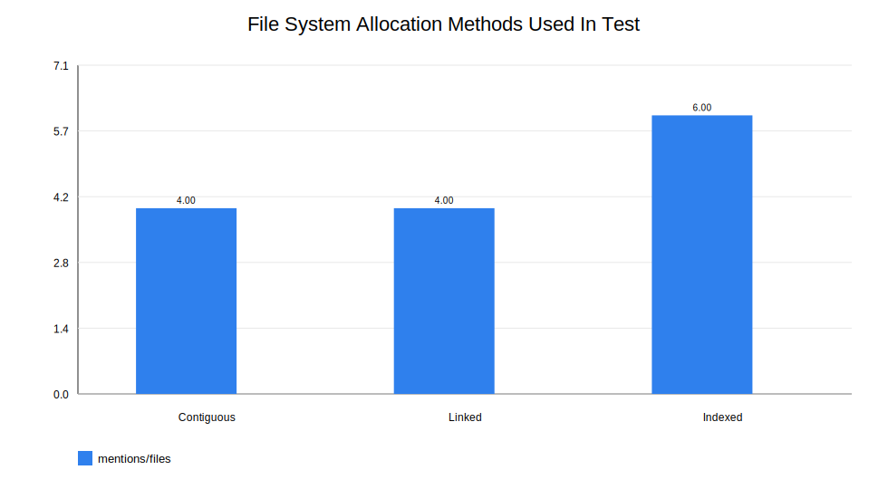

# 操作系统课程设计实验报告（基础部分）

| 项目 | 内容 |
|---|---|
| 课程名称 | 操作系统课程设计 |
| 班级 | 2023 级 计算机科学与技术 1 班 |
| 姓名 | 请填写 |
| 学号 | 请填写 |
| 授课教师 | 杨灿 |
| 小组 | 无，单人完成 |
| 提交日期 | 2026 年 6 月 |
| 代码仓库 | 请上传 GitHub 后填写 |

## 目录

1. 课程设计概述
2. 模块一：处理机调度
3. 模块二：内存管理
4. 模块三：进程同步与并发控制
5. 模块四：文件系统
6. 测试脚本与结果文件
7. 总结
8. 附录：编译与运行说明

## 一、课程设计概述

本课程设计围绕操作系统基础必做部分展开，采用 C++17 实现一个统一菜单式操作系统核心机制模拟系统。系统覆盖处理机调度、内存管理、进程同步与并发控制、文件系统四个基础模块。

本项目虽然不进入自由扩展提升部分，但在基础要求范围内进行了适当增强：处理机调度增加抢占式算法，内存管理增加最坏适应、OPT 页面置换和 Belady 异常验证，文件系统增加三种磁盘块分配方式，并配套自动测试脚本和图表输出，方便进行实验分析和报告整理。

### 1.1 系统结构

```text
os_basic_course_design/
├── include/                 # 模块头文件
├── src/                     # C++ 源代码
│   ├── main.cpp             # 统一菜单入口
│   ├── scheduler.cpp        # 处理机调度
│   ├── memory.cpp           # 内存管理
│   ├── sync_demo.cpp        # 进程同步
│   └── vfs.cpp              # 文件系统
├── tests/                   # 四个模块测试脚本与输入
├── output/                  # 运行结果与 SVG 图表
├── tools/test_runner.py     # 测试与图表生成工具
└── report/                  # 报告材料
```

### 1.2 基础部分完成情况

| 基础模块 | 课程要求 | 本项目完成情况 |
|---|---|---|
| 处理机调度 | 模拟典型调度算法，输出运行顺序、周转时间等 | 实现 FCFS、SJF、RR、非抢占优先级、SRTF、抢占式优先级 6 种算法 |
| 内存管理 | 动态分区与页面置换，展示分配回收，统计缺页率 | 实现 FF、BF、WF；FIFO、LRU、OPT；统计碎片、缺页率、命中率，并验证 Belady 异常 |
| 进程同步 | 使用线程、互斥锁、信号量实现经典同步问题 | 实现生产者-消费者、读者-写者、哲学家进餐 |
| 文件系统 | 支持文件创建、读写、删除和空闲空间管理 | 实现文件创建、写入、读取、追加、删除、位图管理，以及连续/链接/索引分配 |

## 二、模块一：处理机调度

### 2.1 实验目的

处理机调度模块用于模拟操作系统中就绪进程对 CPU 的竞争过程。通过实现多种典型调度算法，观察不同调度策略对平均周转时间、平均等待时间、平均响应时间和带权周转时间的影响。

### 2.2 数据结构设计

进程控制块 PCB 使用如下简化结构表示：

```cpp
struct Process {
    int pid;       // 进程号
    int arrival;   // 到达时间
    int burst;     // 服务时间
    int priority;  // 优先级，数值越小优先级越高
};
```

调度结果使用时间段记录：

```cpp
struct Segment {
    int pid;
    int start;
    int end;
};
```

每个进程最终统计：

- 开始时间
- 完成时间
- 周转时间
- 等待时间
- 响应时间
- 带权周转时间

### 2.3 实现算法

| 算法 | 是否抢占 | 核心思想 | 特点 |
|---|---:|---|---|
| FCFS | 否 | 按到达时间先后顺序执行 | 实现简单，但可能产生护航效应 |
| SJF | 否 | 每次选择服务时间最短的已到达进程 | 平均等待时间较低，但需要预知服务时间 |
| RR | 是 | 按时间片轮转执行 | 公平性好，适合分时系统 |
| Priority | 否 | 每次选择优先级最高的已到达进程 | 能体现任务紧急程度，但可能饥饿 |
| SRTF | 是 | 每个时间单位选择剩余时间最短的进程 | 抢占式 SJF，平均等待时间更低 |
| PriorityPreemptive | 是 | 高优先级进程到达时抢占当前进程 | 响应及时，但低优先级可能长期等待 |

#### 2.3.1 调度模块通用处理流程

本模块先把每个进程抽象为 PCB 记录，保存进程号、到达时间、服务时间和优先级。调度函数不直接输出文本，而是先生成一条由若干 `Segment` 组成的时间线，每个时间段记录某个进程从 `start` 到 `end` 占用 CPU 的情况。如果相邻两个时间段属于同一进程，程序会把它们合并，避免 Gantt 图中出现大量重复片段。这样做的好处是：非抢占算法、抢占算法和时间片轮转算法都可以使用统一的结果表示。

调度结束后，程序根据时间线和每个进程的完成时刻计算指标：

- 周转时间 = 完成时间 - 到达时间。
- 等待时间 = 周转时间 - 服务时间。
- 响应时间 = 第一次获得 CPU 的时间 - 到达时间。
- 带权周转时间 = 周转时间 / 服务时间。
- CPU 利用率 = 忙碌时间 / 总运行时间。
- 吞吐量 = 完成进程数 / 总运行时间。

这些指标关注的角度不同。周转时间反映一个进程从提交到完成经历了多久，等待时间反映就绪队列中的排队代价，响应时间更适合评价交互式系统，带权周转时间则消除了长短作业服务时间不同带来的直接影响。

#### 2.3.2 FCFS 先来先服务

FCFS 首先按到达时间排序，若到达时间相同则按进程号排序。调度时维护当前时刻 `now`，依次取排序后的进程执行。如果 `now` 小于下一个进程的到达时间，说明 CPU 暂时无进程可运行，程序会在时间线中加入 `IDLE` 空闲段；否则进程从 `now` 开始连续运行完整个服务时间。

FCFS 的核心特点是不可抢占、队列规则简单、实现成本低。它的问题在于只看先后顺序，不看服务时间。如果一个长作业很早到达，后续短作业即使运行时间很短也必须等待长作业结束，这就是护航效应。本实验中 P1 服务时间为 8 且最早到达，因此后续 P2、P4、P5 等进程在 FCFS 下都受到前面作业的明显阻塞。

#### 2.3.3 SJF 短作业优先

SJF 是非抢占算法。程序每轮在所有“已经到达且尚未完成”的进程中选择服务时间 `burst` 最短者；若服务时间相同，再选择到达时间更早的进程。选中后，该进程会一次性运行到完成。若当前时刻没有任何进程到达，则把 `now` 跳转到未完成进程中的最早到达时间。

SJF 能降低平均等待时间，因为短作业被优先处理后，可以减少它们在系统中的停留时间。但是 SJF 假设服务时间已知，实际操作系统中往往只能估计 CPU burst；同时，非抢占 SJF 在一个长作业已经开始执行后不会被新来的短作业打断。因此它比 FCFS 更有效率，但仍然无法完全解决“短作业晚到达但希望快速响应”的问题。

#### 2.3.4 RR 时间片轮转

RR 使用就绪队列维护已经到达的进程。每次从队首取出一个进程，最多执行一个时间片 `q`；若进程剩余时间没有用完，则在本轮运行结束后重新加入队尾。程序在每次时间片结束后把这段时间内新到达的进程加入队列，从而保证到达顺序和轮转公平性。

时间片大小直接影响 RR 的表现。时间片过大时，RR 会逐渐接近 FCFS，响应速度下降；时间片过小时，进程切换会变得频繁，实际系统中会带来较多上下文切换开销。本实验取 `q = 3`，能让每个进程较早获得 CPU，因此平均响应时间较低；但一个进程常常需要多轮才能完成，所以平均周转时间比 SJF、SRTF 更高。

#### 2.3.5 Priority 非抢占优先级调度

非抢占优先级调度每轮选择已经到达且优先级数值最小的进程。选中后，该进程连续执行到完成。若多个进程优先级相同，则使用到达时间作为次级排序条件。该算法适合表达任务紧急程度，例如系统任务、实时任务或重要用户任务可以被赋予更高优先级。

优先级调度的主要风险是低优先级进程饥饿。如果高优先级进程不断到达，低优先级进程可能长期得不到 CPU。实际系统常使用老化机制解决这一问题，即随着等待时间增长逐渐提高进程优先级。本项目为了突出基础调度策略，没有加入老化机制，因此结果中可以观察到低优先级长作业等待偏久。

#### 2.3.6 SRTF 最短剩余时间优先

SRTF 是 SJF 的抢占式版本。程序每个时间单位重新扫描所有已到达进程，选择剩余运行时间最短者执行 1 个时间单位。若新进程到达且剩余时间比当前进程更短，当前进程就会被抢占。程序用 `remaining[pid]` 记录每个进程的剩余服务时间，用 `firstStart[pid]` 记录第一次获得 CPU 的时刻。

SRTF 的优势是可以让短作业尽快完成，因此通常能取得较低的平均周转时间和平均等待时间。它的不足是调度决策更频繁，需要维护剩余时间；同时，长作业在短作业持续到达时也可能等待较久。本实验中 SRTF 的平均周转时间和平均带权周转时间最低，说明当前进程序列下“优先完成短剩余时间进程”效果明显。

#### 2.3.7 抢占式优先级调度

抢占式优先级调度同样每个时间单位重新选择可运行进程，但选择依据不是剩余时间，而是优先级数值。只要有更高优先级进程到达，当前运行进程就可能被暂停。实现上仍使用 `remaining` 保存剩余时间，并在进程首次运行时记录响应时间。

该算法比非抢占优先级调度响应更及时，因为高优先级进程不需要等待当前进程完整结束。它适合对紧急任务有要求的场景，但饥饿问题也更明显。若系统长期偏向高优先级进程，低优先级进程的等待时间可能变大，因此实际系统通常需要配合优先级老化或时间片限制。

### 2.4 实验输入

调度实验使用 6 个进程：

| 进程 | 到达时间 | 服务时间 | 优先级 |
|---|---:|---:|---:|
| P1 | 0 | 8 | 3 |
| P2 | 1 | 4 | 1 |
| P3 | 2 | 9 | 4 |
| P4 | 3 | 5 | 2 |
| P5 | 6 | 2 | 1 |
| P6 | 8 | 6 | 3 |

RR 时间片设为 `q = 3`。

### 2.5 实验结果

| 算法 | 平均周转时间 | 平均等待时间 | 平均响应时间 | 平均带权周转时间 | CPU 利用率 | 吞吐量 |
|---|---:|---:|---:|---:|---:|---:|
| FCFS | 18.17 | 12.50 | 12.50 | 4.30 | 100.00% | 0.18 |
| SJF | 15.00 | 9.33 | 9.33 | 2.64 | 100.00% | 0.18 |
| RR | 22.33 | 16.67 | 5.17 | 4.21 | 100.00% | 0.18 |
| Priority | 15.33 | 9.67 | 9.67 | 2.89 | 100.00% | 0.18 |
| SRTF | 13.67 | 8.00 | 4.83 | 2.02 | 100.00% | 0.18 |
| PriorityPreemptive | 13.83 | 8.17 | 6.00 | 2.09 | 100.00% | 0.18 |

图 1 展示了 6 种调度算法在平均周转时间、平均等待时间和平均响应时间上的对比。



图 2 展示了平均带权周转时间。带权周转时间可以体现不同服务时间进程获得服务的相对质量。



图 3 是 RR 时间片轮转算法的 Gantt 图。



### 2.6 结果分析

从平均周转时间看，SRTF 为 13.67，抢占式优先级为 13.83，明显优于 FCFS 的 18.17 和 RR 的 22.33。这说明在本实验的进程序列中，允许抢占能够更灵活地处理新到达的短作业或高优先级作业。SRTF 每个时间单位都重新选择剩余时间最短的进程，因此 P5 这种服务时间很短的进程可以快速完成，降低了系统整体平均周转时间。

从平均等待时间看，SJF、SRTF 和抢占式优先级都比 FCFS 更低。原因是 FCFS 只按照到达顺序执行，P1 长作业最早到达后会阻塞后续多个进程；SJF/SRTF 则把短作业提前处理，使多个短作业等待时间下降。虽然长作业可能等待更久，但平均指标会被多个短作业的改善拉低。

从平均响应时间看，RR 为 5.17，SRTF 为 4.83，均明显低于 FCFS 和非抢占 SJF。这说明抢占或轮转机制可以让进程更早第一次获得 CPU。RR 的优势尤其体现在公平性上：只要进程进入就绪队列，最多等待若干个时间片就能运行一次。因此 RR 更适合分时系统和交互式系统，而不是追求批处理作业的最短完成时间。

从带权周转时间看，SRTF 的 2.02 最低。带权周转时间把周转时间除以服务时间，因此对短作业是否被过度等待比较敏感。FCFS 的带权周转时间较高，说明短作业在长作业之后排队时，相对于自身服务时间付出了较大的等待代价。SRTF 能优先完成短剩余时间进程，所以该指标表现最好。

优先级调度的表现介于 SJF 系列和 FCFS/RR 之间。非抢占优先级调度在当前进程运行期间不会响应新到达的高优先级进程，因此改善有限；抢占式优先级调度可以及时让高优先级进程运行，所以平均周转时间进一步下降。但 P3 的优先级较低、服务时间较长，在优先级策略下容易被推迟，这体现了低优先级饥饿风险。若要进一步完善该算法，可以加入老化机制：进程等待时间越长，优先级逐步提高。

六种算法的 CPU 利用率均为 100%，是因为本组输入中第一个进程在 0 时刻到达，之后就绪队列始终没有完全为空，CPU 没有出现空闲段。吞吐量均为 0.18，是因为所有算法都完成同样的 6 个进程，总服务时间相同，且没有空闲等待；不同算法改变的是每个进程完成的先后和等待分布，而不是总工作量。

## 三、模块二：内存管理

### 3.1 实验目的

内存管理模块包括动态分区管理和页面置换两部分。动态分区管理用于模拟连续内存分配与回收过程，页面置换用于模拟虚拟存储系统中物理块不足时的页面淘汰策略。

### 3.2 动态分区管理

#### 3.2.1 实现算法

| 算法 | 策略 | 优点 | 缺点 |
|---|---|---|---|
| FF 首次适应 | 从低地址开始选择第一个满足大小的空闲分区 | 查找速度较快 | 低地址容易形成碎片 |
| BF 最佳适应 | 选择满足要求且最小的空闲分区 | 尽量保留大分区 | 容易产生小碎片 |
| WF 最坏适应 | 选择最大的空闲分区 | 剩余空间仍较大 | 可能破坏大块连续空间 |

动态分区表使用如下结构：

```cpp
struct Partition {
    int start;
    int size;
    bool free;
    string owner;
};
```

动态分区管理把整块内存看作若干连续分区，每个分区记录起始地址、大小、是否空闲和占用它的作业名。初始化时只有一个空闲分区，即 `start=0, size=totalSize`。当作业申请内存时，程序先根据算法选择一个空闲分区；如果该分区大小刚好等于申请大小，则直接把它标记为占用；如果该分区大于申请大小，则把它切分成“已分配分区”和“剩余空闲分区”两段。

释放内存时，程序按作业名找到对应分区，将其状态改为空闲，然后扫描分区表，把相邻的空闲分区合并。合并操作非常关键，因为如果只释放不合并，内存会被大量小空闲块分割，即使总空闲空间足够，也可能因为没有连续大块而无法满足后续申请。

三种算法的差异主要体现在选择空闲分区的方式：

- FF 从分区表头开始扫描，遇到第一个满足大小的空闲分区就分配。它通常查找速度快，但低地址空间会被频繁切分。
- BF 扫描所有空闲分区，选择满足要求且大小最小的分区。它希望每次剩余空间尽量少，但容易制造很小且难以再次利用的碎片。
- WF 扫描所有空闲分区，选择最大的空闲分区。它希望分配后仍留下较大的剩余空间，但如果持续切分最大块，可能更快破坏大块连续空间。

本模块每次申请或释放后都会输出分区表和统计信息。统计中的“外部碎片数”指当前空闲分区个数，“最大空闲块”反映后续能否满足大作业，“总空闲空间”和“内存利用率”用于衡量整体占用情况。

#### 3.2.2 实验过程

测试脚本使用 640 单位内存。为了体现三种动态分区算法的差异，实验先通过分配和回收构造多个可满足后续申请的空闲分区，再分别使用 FF、BF、WF 处理同一组请求。

```text
申请 A=100
申请 B=200
申请 C=50
申请 D=80
申请 E=70
释放 B
释放 D
申请 F=75
申请 G=120
申请 H=60
```

释放 B 和 D 后，内存中形成 200、80、140 三个空闲分区。之后申请 F、G、H 时，FF、BF、WF 会按照各自策略选择不同空闲分区，因此最终分区表不同。

FF 首次适应最终分区情况：

| 起址 | 大小 | 状态 | 作业 |
|---:|---:|---|---|
| 0 | 100 | 占用 | A |
| 100 | 75 | 占用 | F |
| 175 | 120 | 占用 | G |
| 295 | 5 | 空闲 | FREE |
| 300 | 50 | 占用 | C |
| 350 | 60 | 占用 | H |
| 410 | 20 | 空闲 | FREE |
| 430 | 70 | 占用 | E |
| 500 | 140 | 空闲 | FREE |

BF 最佳适应最终分区情况：

| 起址 | 大小 | 状态 | 作业 |
|---:|---:|---|---|
| 0 | 100 | 占用 | A |
| 100 | 60 | 占用 | H |
| 160 | 140 | 空闲 | FREE |
| 300 | 50 | 占用 | C |
| 350 | 75 | 占用 | F |
| 425 | 5 | 空闲 | FREE |
| 430 | 70 | 占用 | E |
| 500 | 120 | 占用 | G |
| 620 | 20 | 空闲 | FREE |

WF 最坏适应最终分区情况：

| 起址 | 大小 | 状态 | 作业 |
|---:|---:|---|---|
| 0 | 100 | 占用 | A |
| 100 | 75 | 占用 | F |
| 175 | 60 | 占用 | H |
| 235 | 65 | 空闲 | FREE |
| 300 | 50 | 占用 | C |
| 350 | 80 | 空闲 | FREE |
| 430 | 70 | 占用 | E |
| 500 | 120 | 占用 | G |
| 620 | 20 | 空闲 | FREE |

统计结果：

| 算法 | 分区数 | 外部碎片数 | 最大空闲块 | 总空闲空间 | 内存利用率 |
|---|---:|---:|---:|---:|---:|
| FF | 9 | 3 | 140 | 165 | 74.22% |
| BF | 9 | 3 | 140 | 165 | 74.22% |
| WF | 9 | 3 | 80 | 165 | 74.22% |

图 4 展示 FF、BF、WF 三种动态分区算法在同一组申请序列下形成的最终内存布局。三行布局共用同一地址刻度，可以直观看出算法选择策略对空闲分区位置和最大空闲块的影响。



### 3.3 页面置换算法

#### 3.3.1 实现算法

| 算法 | 淘汰策略 | 是否可能出现 Belady 异常 | 特点 |
|---|---|---:|---|
| FIFO | 淘汰最早进入内存的页面 | 是 | 实现简单，但不考虑访问局部性 |
| LRU | 淘汰最长时间未被访问的页面 | 否 | 利用局部性原理，实际效果较好 |
| OPT | 淘汰未来最晚访问的页面 | 否 | 理论最优，但实际系统无法预知未来 |

页面置换模拟过程按页面访问串逐个处理。每访问一个页面，程序先检查该页面是否已经在物理块中；如果存在，则记为命中，不发生置换；如果不存在，则记为缺页。缺页时如果仍有空闲物理块，就直接装入；如果物理块已满，就根据具体置换算法选择一个牺牲页替换出去。

FIFO 使用队列保存页面进入内存的先后顺序。发生缺页且物理块已满时，队首页面最早进入内存，因此被淘汰。FIFO 不关心页面最近是否被频繁访问，所以可能把仍然活跃的页面换出。

LRU 使用 `lastUse` 记录每个页面最近一次被访问的时间。发生置换时，程序在当前物理块中选择 `lastUse` 最小的页面，也就是最长时间没有被访问的页面。LRU 的依据是程序局部性原理：最近访问过的页面未来仍可能被访问，因此优先保留近期活跃页面。

OPT 在每次缺页时向后扫描未来访问串，查看当前物理块中的每个页面下一次会在什么时候被访问。若某个页面未来不再出现，则它是最佳淘汰对象；否则淘汰未来最晚再次访问的页面。OPT 需要预知未来访问序列，实际系统无法直接实现，但它可以作为理论最优对照，用来评价 FIFO 和 LRU 的差距。

页面访问串：

```text
7 0 1 2 0 3 0 4 2 3 0 3 2 1 2 0 1 7 0 1
```

物理块数为 3。

#### 3.3.2 实验结果

| 算法 | 缺页次数 | 访问次数 | 缺页率 | 命中率 |
|---|---:|---:|---:|---:|
| FIFO | 15 | 20 | 75.00% | 25.00% |
| LRU | 12 | 20 | 60.00% | 40.00% |
| OPT | 9 | 20 | 45.00% | 55.00% |

图 5 展示三种页面置换算法的缺页次数、缺页率和命中率。



#### 3.3.3 Belady 异常验证

使用经典页面访问串：

```text
1 2 3 4 1 2 5 1 2 3 4 5
```

实验结果：

| 物理块数 | FIFO 缺页次数 |
|---:|---:|
| 3 帧 | 9 |
| 4 帧 | 10 |

可以看到，当物理块数从 3 增加到 4 时，FIFO 的缺页次数反而从 9 增加到 10，说明 Belady 异常成立。



### 3.4 结果分析

动态分区实验展示了连续内存分配中分割、回收、合并和算法选择的重要性。本组数据在释放 B、D 后形成多个空闲分区，因此后续申请会触发 FF、BF、WF 的策略差异。FF 从低地址开始分配，F 和 G 会优先占用 B 释放出的 200 单位空闲区，使低地址区域被连续切分；H 随后进入 D 释放出的 80 单位空闲区。BF 会选择最接近申请大小的空闲区，例如 H=60 会进入 200 单位空闲区中切分后的剩余空间，最终留下 5、20 等小碎片。WF 每次选择最大空闲块，G=120 会优先使用 140 单位空闲区，最终最大空闲块只有 80。

从统计结果看，三种算法最终总空闲空间都是 165，内存利用率也都是 74.22%，因为它们处理的是同一组申请和释放，已分配作业总大小相同。但是最大空闲块不同：FF 和 BF 为 140，WF 为 80。这说明评价动态分区算法不能只看内存利用率，还要看空闲空间是否连续。如果后续来了一个 100 单位的大作业，FF 和 BF 仍有机会满足，而 WF 在当前状态下会因为最大空闲块不足而失败。

页面置换实验中，OPT 缺页次数为 9，是理论最优结果；LRU 缺页 12 次，明显好于 FIFO 的 15 次。原因是访问串中存在局部性，例如页面 0、2、3 在一段时间内重复出现。LRU 能根据最近访问历史保留这些活跃页面，而 FIFO 只根据进入内存的先后顺序淘汰，可能把刚刚还在使用的页面换出。

Belady 异常验证进一步说明 FIFO 的局限。在经典访问串中，物理块从 3 帧增加到 4 帧后，FIFO 缺页次数从 9 增加到 10。直观原因是 FIFO 的队列顺序与页面未来是否还会被使用无关，增加物理块可能改变页面进入和淘汰顺序，反而使某些后续需要的页面更早被淘汰。LRU 和 OPT 属于栈类算法，不会出现这种“内存增加但缺页更多”的现象。

因此，页面置换算法的选择本质上是在实现复杂度和缺页性能之间权衡。FIFO 简单但性能不稳定；LRU 更符合局部性，但需要维护访问历史；OPT 性能最好但只能用于理论分析和实验对照。

## 四、模块三：进程同步与并发控制

### 4.1 实验目的

进程同步模块使用多线程模拟操作系统中的经典同步问题，理解互斥、同步、死锁预防和数据竞争避免方法。

本项目使用 C++ 标准线程库：

- `std::thread`
- `std::mutex`
- `std::condition_variable`
- 自定义计数信号量 `CountingSemaphore`

### 4.2 生产者-消费者问题

#### 同步关系

| 资源/信号量 | 含义 |
|---|---|
| `bufferMutex` | 保护缓冲区互斥访问 |
| `emptySlots` | 表示缓冲区剩余空槽数 |
| `fullSlots` | 表示缓冲区已有产品数 |

实验中设置：

- 缓冲区大小：5
- 生产者数量：2
- 消费者数量：2
- 每个生产者生产 6 个产品

生产者每次生产前需要等待空槽，消费者每次消费前需要等待产品。缓冲区操作使用互斥锁保护，因此不会出现多个线程同时修改队列导致的数据竞争。

本项目自定义 `CountingSemaphore`，内部由 `mutex`、`condition_variable` 和计数值组成。`acquire()` 操作会在计数值为 0 时阻塞，直到其他线程释放资源；`release()` 操作增加计数值并唤醒一个等待线程。生产者-消费者问题中，`emptySlots` 初值为缓冲区容量 5，`fullSlots` 初值为 0。

生产者线程的执行顺序是：先执行 `emptySlots.acquire()` 等待空槽，再进入 `bufferMutex` 保护的临界区，将新产品加入队列，最后执行 `fullSlots.release()` 通知消费者有新产品可取。消费者线程的执行顺序相反：先等待 `fullSlots`，再进入临界区取出队首产品，取出后释放 `emptySlots`，表示缓冲区多出一个空位。

程序还使用结束标记 `-1` 通知消费者退出。所有生产者结束后，主线程向缓冲区放入与消费者数量相同的结束标记。消费者取到普通产品时继续消费，取到 `-1` 时退出循环。这种设计避免消费者在产品全部消费完后永久阻塞在 `fullSlots.acquire()` 上。

### 4.3 读者-写者问题

读者-写者问题要求多个读者可以同时读，但写者必须独占访问。本项目实现了写者优先策略：当有写者等待时，新读者需要等待，从而减少写者饥饿。

| 场景 | 是否允许 | 原因 |
|---|---:|---|
| 读者 + 读者 | 允许 | 读操作不修改共享数据 |
| 读者 + 写者 | 不允许 | 写时需要保证数据一致性 |
| 写者 + 写者 | 不允许 | 多个写者同时写会造成竞争 |

实现中封装了 `ReaderWriterLock`，核心状态包括 `activeReaders_`、`waitingWriters_` 和 `writerActive_`。读者申请读锁时，只有在当前没有写者正在写、并且没有写者等待时才允许进入；进入后 `activeReaders_` 加一。读者释放读锁时，`activeReaders_` 减一，并唤醒等待线程。

写者申请写锁时，先让 `waitingWriters_` 加一，表示有写者正在等待。随后它会等待两个条件同时成立：没有写者正在写，且当前活跃读者数为 0。写者真正进入临界区后，将 `writerActive_` 置为 true；写完后再置回 false 并唤醒其他线程。

该实现体现的是写者优先策略。只要 `waitingWriters_ > 0`，新读者就不能继续进入，这样可以防止读者源源不断到来导致写者长期等待。代价是读者吞吐量可能略有下降，因为部分新读者会为了等待写者而阻塞。

### 4.4 哲学家进餐问题

哲学家进餐问题用于验证死锁预防策略。系统中 5 位哲学家围坐，每人左右各有一把叉子，哲学家必须同时获得左右两把叉子才能进餐。

本项目采用两种防死锁措施：

1. 使用服务员信号量，最多允许 4 位哲学家同时竞争叉子。
2. 使用 `std::lock` 同时申请左右两把叉子，避免锁获取顺序不一致导致死锁。

如果 5 位哲学家都先拿起左边叉子，再等待右边叉子，就会形成循环等待：每个人占有一个资源，同时等待另一个资源，系统无法继续推进。服务员信号量 `waiter` 的初值为 4，意味着最多只有 4 位哲学家能进入拿叉子的阶段，至少会留下一位哲学家不占用叉子，从而破坏死锁四个必要条件中的循环等待条件。

此外，程序使用 `std::lock(forks[left], forks[right])` 同时申请左右两把叉子。`std::lock` 会使用标准库提供的避免死锁算法来获取多个互斥锁，成功后再用 `std::lock_guard` 的 `adopt_lock` 接管锁所有权。这样即使不同哲学家申请叉子的左右顺序不同，也不会因为手动加锁顺序不一致而产生交叉等待。

每位哲学家重复“思考-申请服务员许可-申请两把叉子-进餐”的过程 3 轮。输出中可以看到多个线程交错执行，但程序能够正常结束，说明互斥和死锁预防策略有效。

### 4.5 实验结果与图表

同步模块测试脚本会依次运行：

- 生产者-消费者
- 读者-写者
- 哲学家进餐

程序输出显示，产品能够被完整生产和消费，读写互斥关系正确，哲学家进餐过程没有死锁。

图 7 展示同步事件时间线，不同线程的执行交错可以反映并发程序的实际运行特征。



### 4.6 结果分析

生产者-消费者问题体现了信号量在“资源数量控制”中的作用。`emptySlots` 防止生产者在缓冲区满时继续写入，`fullSlots` 防止消费者在缓冲区空时读取。互斥锁只保护对队列的短时间修改，生产和消费的等待逻辑由信号量负责，因此同步关系清晰。实验输出中缓冲区大小不会超过 5，也不会在空缓冲区中消费产品，说明容量约束和互斥访问都正确。

读者-写者问题体现了共享资源访问权限的分级控制。多个读者并发提高了读效率，写者独占保证了数据一致性。本项目采用写者优先，因此当写者等待时，新读者不会继续插队。这可以减少写者饥饿，但也说明同步策略不是唯一的：若系统以读操作为主，可以选择读者优先；若需要公平性，可以使用排队式读写锁。

哲学家进餐问题体现了死锁预防思想。死锁通常需要互斥、占有并等待、不可抢占和循环等待四个条件同时成立。本项目不改变叉子的互斥属性，也不强行抢占已经拿到的叉子，而是通过服务员信号量限制同时竞争人数，并用 `std::lock` 统一申请多把锁，从而破坏循环等待条件。实验中所有哲学家都能完成 3 轮进餐，说明程序没有出现死锁或永久等待。

总体来看，同步模块的关键不是让线程“按固定顺序”执行，而是在任意调度交错下仍然保证共享数据正确、资源数量不越界、程序最终可以推进。时间线图中不同线程事件交错出现，正说明并发执行具有不确定性；只要临界区保护和同步条件设计正确，最终结果仍然是可控的。

## 五、模块四：文件系统

### 5.1 实验目的

文件系统模块模拟磁盘块、目录项、文件读写和空闲空间管理机制。通过实现文件创建、写入、读取、追加、删除，以及三种磁盘块分配方式，加深对文件组织和存储管理的理解。

### 5.2 文件目录项设计

文件目录项包括：

```cpp
struct FileEntry {
    string name;
    int size;
    AllocationMode mode;
    vector<int> dataBlocks;
    int indexBlock;
};
```

其中：

- `name` 表示文件名
- `size` 表示文件大小
- `mode` 表示文件采用的磁盘块分配方式
- `dataBlocks` 记录数据块号
- `indexBlock` 用于索引分配方式

### 5.3 空闲空间管理

系统使用位图管理空闲磁盘块：

```text
0 表示空闲
1 表示占用
```

每次文件写入时，系统按当前分配方式申请磁盘块；文件删除时，系统释放该文件占用的数据块和索引块，并更新位图。

本项目把虚拟磁盘表示为两个数组：`bitmap_` 记录每个磁盘块是否占用，`disk_` 保存每个磁盘块中的字符串内容。文件系统初始化时，所有位图项均为 0，表示磁盘块全部空闲。写文件时，程序根据文件大小和块大小计算所需数据块数：

```text
dataNeed = ceil(fileSize / blockSize)
```

如果文件原来已经占用磁盘块，写入新内容前会先释放旧块，再按当前分配方式重新申请空间。这样可以简化覆盖写入逻辑，也能让目录项中的大小、数据块和分配方式保持一致。读文件时，程序按目录项记录的数据块顺序拼接块内容，再按文件实际大小截断，避免最后一个块中未使用空间影响读取结果。

删除文件时，程序释放目录项中记录的所有数据块；如果文件采用索引分配，还会额外释放索引块。随后从目录映射中删除该文件。位图变化可以直接反映文件创建、写入、删除对磁盘空间的影响。

### 5.4 三种磁盘块分配方式

| 分配方式 | 原理 | 优点 | 缺点 |
|---|---|---|---|
| 连续分配 | 文件占用连续磁盘块 | 顺序访问和随机访问效率高 | 需要连续空间，容易受外部碎片影响 |
| 链接分配 | 文件数据块可以离散分布，块之间形成链 | 空间利用灵活，文件扩展方便 | 随机访问效率低 |
| 索引分配 | 使用索引块保存所有数据块号 | 支持随机访问，空间分配灵活 | 需要额外索引块开销 |

连续分配调用 `allocateContiguous`。程序顺序扫描位图，维护当前连续空闲段的起点 `runStart` 和长度 `runLen`；当连续空闲长度达到文件所需块数时，就把这一段全部标记为占用，并记录到 `dataBlocks` 中。如果扫描结束仍找不到足够长的连续空闲段，则分配失败。连续分配的随机访问很方便，因为第 `i` 个逻辑块可以直接映射为 `startBlock + i`，但它对连续空闲空间要求高。

链接分配调用 `allocateAny`，只要求磁盘中空闲块总数足够，不要求连续。程序从低块号开始扫描位图，遇到空闲块就分配给文件，直到达到所需数量。在真实文件系统中，链接分配通常会在每个数据块中保存下一个块号；本项目为了简化模拟，把块号顺序集中保存在目录项 `dataBlocks` 中。它的空间利用灵活，但访问文件中间位置需要沿块序列逐步查找。

索引分配也先使用 `allocateAny` 为数据内容申请若干数据块，然后再额外申请 1 个索引块。索引块中保存所有数据块号，目录项的 `indexBlock` 指向该索引块。本项目会把数据块号写入索引块内容，便于在文件详细信息中观察。索引分配兼顾离散存储和随机访问，但小文件也要付出一个索引块的额外开销。

三种方式在同一套位图和目录项上实现，因此可以在测试过程中切换当前分配方式，观察相同磁盘空间下不同文件组织策略的差异。

### 5.5 实验过程

测试脚本使用：

- 磁盘块数：24
- 块大小：8 字节

主要操作：

```text
创建 contig.txt，使用连续分配写入 ABCDEFGHIJ
切换为链接分配
创建 link.txt，写入 linked allocation blocks demo
切换为索引分配
创建 index.txt，写入 indexed allocation supports random access
显示目录项
显示空闲空间位图
查看 index.txt 详细信息
删除 link.txt
再次显示目录项和位图
```

### 5.6 实验结果

删除 `link.txt` 前目录项：

| 文件名 | 大小 | 分配方式 | 索引块 | 数据块 |
|---|---:|---|---|---|
| contig.txt | 10 | 连续分配 | - | 0 1 |
| link.txt | 29 | 链接分配 | - | 2 3 4 5 |
| index.txt | 41 | 索引分配 | 12 | 6 7 8 9 10 11 |

删除 `link.txt` 后，释放了块 2、3、4、5，位图中相应位置从占用变为空闲。

图 8 展示文件系统位图变化。



图 9 展示测试中三种分配方式的使用情况。



### 5.7 结果分析

连续分配适合大小固定且需要快速随机访问的文件。实验中 `contig.txt` 大小为 10 字节，块大小为 8 字节，因此需要 2 个数据块，系统分配了连续的 0、1 号块。连续分配的目录项很简单，只要记录起始块和长度即可推导出全部数据块；本项目为了统一显示，仍然把块号全部记录在 `dataBlocks` 中。

链接分配不要求连续空间，删除和扩展更灵活。`link.txt` 占用 2、3、4、5 号块，删除后这些块在位图中从 1 变回 0。由于链接分配只依赖空闲块总数，不依赖连续空闲段，因此在磁盘碎片较多时仍能较容易分配成功。但它的随机访问效率低，如果要读取第 k 个块，需要沿链查找前面的块。

索引分配通过索引块保存数据块号，随机访问效率较高。`index.txt` 的数据块为 6、7、8、9、10、11，索引块为 12。访问某个逻辑块时，可以先读取索引块，再根据索引表直接找到对应数据块。它的缺点是需要额外索引块，尤其对很小的文件来说，索引开销占比可能较高。

从位图变化看，文件系统的空间管理核心是“分配时置 1，释放时置 0”。删除 `link.txt` 后，目录项被移除，数据块被释放，但 `contig.txt` 和 `index.txt` 仍保持原有块号不变。这说明文件删除只影响目标文件占用的块，不会移动其他文件内容。本项目没有实现磁盘整理，因此释放出的 2、3、4、5 号块会作为空闲洞保留下来，后续新文件可以再次使用。

三种分配方式体现了文件系统设计中的典型取舍：连续分配访问效率高但抗碎片能力弱；链接分配空间利用灵活但随机访问差；索引分配随机访问好且允许离散存储，但需要额外索引空间。实际文件系统通常会结合这些思想，例如使用多级索引、区段 extent 或日志结构来进一步平衡性能和空间利用率。

## 六、测试脚本与结果文件

项目提供四个独立测试脚本：

```powershell
powershell -ExecutionPolicy Bypass -File tests\run_scheduler_test.ps1
powershell -ExecutionPolicy Bypass -File tests\run_memory_test.ps1
powershell -ExecutionPolicy Bypass -File tests\run_sync_test.ps1
powershell -ExecutionPolicy Bypass -File tests\run_filesystem_test.ps1
```

也可以一次性运行全部测试：

```powershell
powershell -ExecutionPolicy Bypass -File tests\run_all_tests.ps1
```

脚本会自动：

1. 设置 PowerShell UTF-8 编码，避免中文乱码。
2. 编译 C++ 项目。
3. 运行对应模块的测试输入。
4. 保存完整文本输出到 `output/*.txt`。
5. 生成实验图表到 `output/*.svg`。

结果文件如下：

| 文件 | 内容 |
|---|---|
| `scheduler_output.txt` | 调度模块完整运行输出 |
| `memory_output.txt` | 内存管理完整运行输出 |
| `sync_output.txt` | 同步并发完整运行输出 |
| `filesystem_output.txt` | 文件系统完整运行输出 |

图表文件如下：

| 图表 | 内容 |
|---|---|
| `scheduler_metrics.svg` | 调度算法平均周转、等待、响应对比 |
| `scheduler_weighted_turnaround.svg` | 平均带权周转时间对比 |
| `scheduler_rr_gantt.svg` | RR 时间片轮转 Gantt 图 |
| `memory_partition_map.svg` | 动态分区最终内存布局对比 |
| `memory_partition_compare.svg` | FF/BF/WF 动态分区最终内存布局对比 |
| `memory_page_replacement.svg` | 页面置换缺页率/命中率对比 |
| `memory_belady_anomaly.svg` | Belady 异常验证 |
| `sync_timeline.svg` | 同步并发事件时间线 |
| `filesystem_bitmap.svg` | 文件系统空闲空间位图变化 |
| `filesystem_allocation_methods.svg` | 文件系统分配方式测试图 |

## 七、总结

本课程设计完成了操作系统基础部分四个核心模块。

在处理机调度部分，实验验证了不同调度算法在公平性、响应时间和平均周转时间之间的取舍。SRTF 在本实验中总体指标最优，RR 响应较快但周转时间较高。

在内存管理部分，动态分区实验展示了内存分配、释放和外部碎片形成过程；页面置换实验表明 OPT 是理论最优，LRU 通常优于 FIFO，同时 FIFO 可能出现 Belady 异常。

在进程同步部分，三大经典问题展示了互斥锁、条件变量和信号量在并发控制中的作用。程序能够避免数据竞争和死锁，说明同步机制设计正确。

在文件系统部分，实验实现了文件基本操作、目录项管理、空闲空间位图和三种磁盘块分配方式。通过位图变化可以直观看到文件创建和删除对磁盘空间的影响。

整体来看，本项目将操作系统基础理论转化为可运行、可测试、可分析的程序，并配套生成实验结果和图表，能够较完整地支撑基础部分课程设计报告。

## 八、附录：编译与运行说明

### 8.1 Windows PowerShell

进入项目目录：

```powershell
cd "E:\大三下\os_basic\os_basic_course_design"
```

推荐运行测试脚本：

```powershell
powershell -ExecutionPolicy Bypass -File tests\run_all_tests.ps1
```

也可以手动编译：

```powershell
g++ -std=c++17 -Wall -Wextra -pedantic -O2 -pthread -finput-charset=UTF-8 -fexec-charset=UTF-8 -Iinclude -o os_basic.exe src\main.cpp src\scheduler.cpp src\memory.cpp src\sync_demo.cpp src\vfs.cpp
.\os_basic.exe
```

### 8.2 Linux

```bash
make
./os_basic
```

### 8.3 中文乱码处理

若 PowerShell 出现中文乱码，可执行：

```powershell
chcp 65001
[Console]::InputEncoding = [System.Text.Encoding]::UTF8
[Console]::OutputEncoding = [System.Text.Encoding]::UTF8
```

测试脚本中已经自动设置 UTF-8，一般不需要手动处理。

### 8.4 代码访问方式

课程要求报告中包含代码 URL。上传 GitHub 后填写：

```text
代码地址：https://github.com/<用户名>/<仓库名>
访问方式：公开仓库，可直接访问；或私有仓库，提供教师可访问权限。
```
